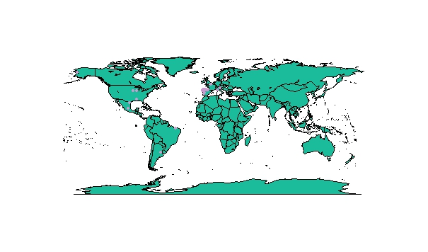

# How-to-geocode-your-data-with-R
from www.ramiroaznar.com website

In my first post I would like to introduce you one of the easiest ways to geocode your data. Geocoding is one of the most essential functionalities within the spatial analysis. It allow us to transform a description of a location, generally an address, postcode or similar, into a pair of coordinates -longitude, latitude or X, Y-. Then we can map our data.



There are an increasing wide diversity of alternatives to geocode our datasets. From websites to programming applications. Here I will show you how to do it using R. First, it is necessary to download and install R (I recomend using RStudio, a more friendly desktop IDE). Secondly, you have to set up your working environment. Then  load your data. For this tutorial I have scraped and clean a csv dataset called fires of the 100 Spanish towns with more fires from 2001 to 2013 from the España en Llamas website. You can download it here. In addition, I have created a GitHub repository with all the material covered in this post.

## Setting your working directory & loading data

```{r}
setwd("D:/data/fires") #Copy and paste your own pathfile
fires <- read.csv("fires.csv", header = TRUE, sep = ",", stringsAsFactors=FALSE) #Load and name it
```

Now it is turn of the funny stuff. In order to geocode our data, we are going to use the geocode() function from the ggmap package which uses the Google Maps API. First install the libraries needed and then call the function as this:

## Installing libraries and geocoding

```{r}
library(ggplot2)
library(ggmap)
lonlat <- geocode(fires$town_name) #Generate lon/lat values for each town
```

After the geocoding process that should last a few minutes to be completed, time to merge the lonlat dataset wich you have just generated and the original dataset. In order to achieve this, we must create an id column to match our rows:

## Merging and saving both datasets

```{r}
lonlat$id <- seq.int(nrow(lonlat)) #Add an id column
write.csv(lonlat, "lonlat.csv") #Save dataset
fires$id <- seq.int(nrow(fires)) #Add an id column
write.csv(fires, "fires.csv") #Save dataset
fires_lonlat <- merge(fires, lonlat, by.x = "id") #Merge datasets with id column
write.csv(fires_lonlat, "fires_lonlat.csv") #Save dataset
```

We can stop here. But it is more than advisable to explore your data in order to look for outliers. For this task, we plot our towns as dots over a simple worldmap (see figure above). Any point outside the Spanish borders will be considered as an outlier. So we will need to correct our data again.

## Looking for outliers

```{r}
library(maps)
map("world", col="#1ABC9C", fill=TRUE, bg="#F8F8FF", lwd=0.05) #Plot a worldmap
points(fires_lonlat$lon, fires_lonlat$lat, pch=19, col="#CA99CE", cex=0.5) #Plot dots
```

As you can observe there are plenty of outliers. In the next post I will explain how to select these rebel dots and correct them.
